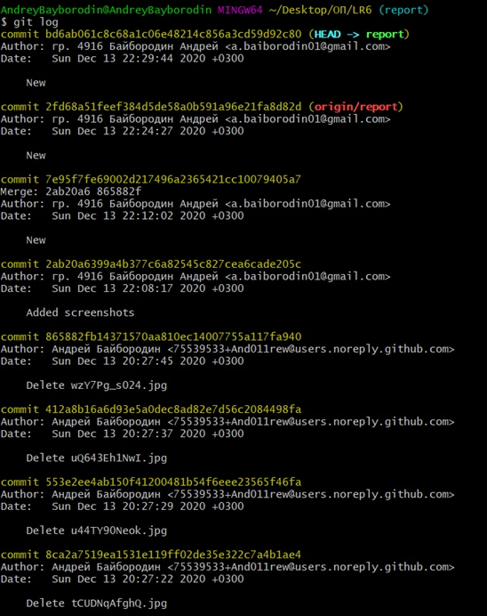

##Отчет по лабораторной работе №6 
##По курсу: Основы программирования
##Выполнил студент гр. 4916 А.В. Байбородин

###Ход работы:
На сайте GitHub сделал копию https://github.com/Kurtyanik/LR6/

Настроил клиент, введя имя пользователя и email

С помощью команды _cd Desktop/ОП/LR6_ в консоли Git Bash перешёл в созданную папку LR6
Использовал команду _git init_ чтобы инициализировать гит в данной папке

Командой _git remote add origin_ связал папку с удалённым репозиторием и командой _git clone_ клонировал удаленный репозиторий на компьютер на сайте GitHub

Через интерфейс GitHub добавил новый файл _NewFile.txt_ в удалённый репозиторий и добавил его в ветку __master__

Используя команду _git pull origin master_ загрузил изменения из удалённого репозитория в локальный

Командой _git log_ получил список коммитов

Используя _git show_ получил более подробную информацию по последнему изменению

Командой _git checkout -t branch1_ переключился ветку **branch1** и обратно на ветку **master**

При попытке выполнить слияние веток **master** и **branch1** с помощью команды _git merge branch1_ я получил ошибку

Вручную изменил содержание файла mergefile.txt, устранив ошибку слияния и выполнил коммит

Выполнил слияние веток **master** и **branch1** с помощью команды _git merge branch1_ и удалил ветку **branch1** командой _git branch -d branch1_

Занес всё в удалённый репозиторий командой _git push origin master_ 

Добавил два новых файла

Командой _git reset --hard HEAD~1_ выполнил откат последнего коммита, а именно добавления файла File2.txt и занес изменённую ветку в удаленный репозиторий

Используя команду _git checkout -b report_ создал новую ветку **report**

С помощью команды _git add ._ подготовил все новые файлы в папке LR6 к добавлению в удаленный репозиторий

Запушил файлы скриншотов в удалённый репозиторий

Оформил отчёт в файле README.md, используя блокнот

Лог команд из папки **.git/logs**

Финальный результат команды _git log_

Все скриншоты лежат в папке **screenshots**